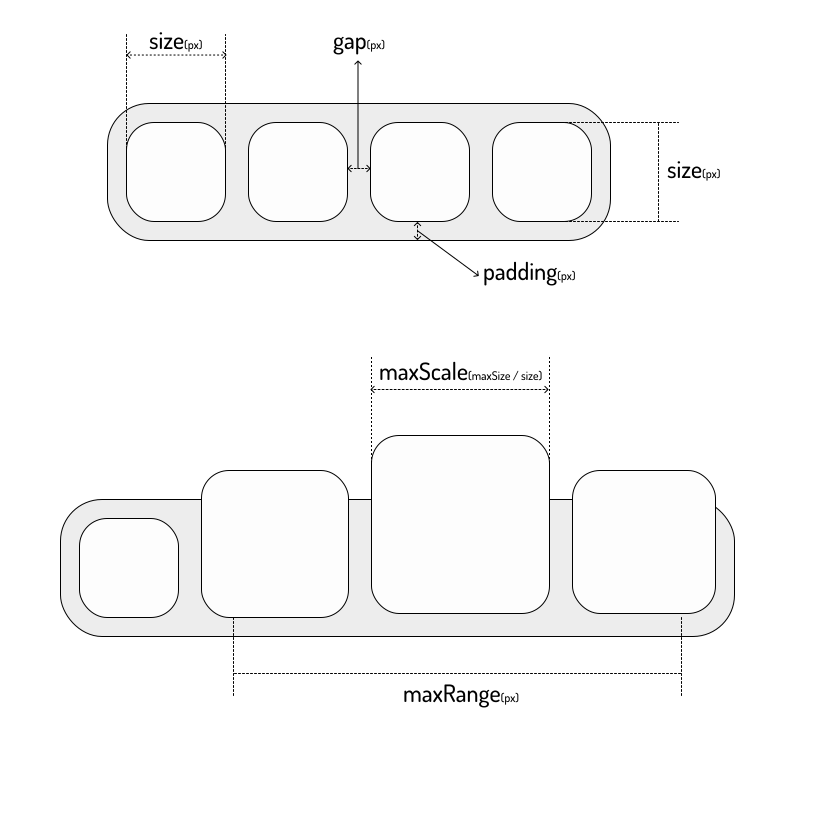

<!-- Logo -->
<p align="center">
  
</p>

<!-- Bridge -->
<h2 align="center">dockbar</h2>
<!-- Description -->
<p align="center">
  A macOS like dockbar component made with <a href="https://developer.mozilla.org/en-US/docs/Web/Web_Components">Web Components</a>
  <br>
  that can be used in any framework.
</p>
<p align="center">
  
  
  
</p>

<!-- <p align="center">
  <a href="./docs/README.zh.md"> 
    
  </a>
</p>

<p align="center">
  <a href="https://cursor.oooo.so">
    
  </a>
</p> -->

---

## Install

- **NPM**
  
  ```bash
  npm install dockbar --save
  ```

- **CDN**

  ESM([Example](./examples/esm/index.html))
  
  ```html
  <head>
    <script type="module" src="https://unpkg.com/dockbar@latest/dockbar.js"></script>
  </head>
  ```

  IIFE([Example](./examples/iife/index.html))

  ```html
  <head>
    <script src="https://unpkg.com/dockbar@latest/dockbar.iife.js"></script>
  </head>

  See [cursor.oooo.so](https://ipad-cursor.oooo.so) for more details.

## Usage

### Basic usage

```html
<body>
  <dock-wrapper>
    <dock-item>1</dock-item>
    <dock-item>2</dock-item>
    <dock-item>3</dock-item>
    <dock-item>4</dock-item>
  </dock-wrapper>
</body>
```

It is recommended to use a custom element inside `dock-item`, so that you can customize the content of `dock-item`.

```html
<dock-wrapper>
  <dock-item>
    <div class="my-element"></div>
  </dock-item>
</dock-wrapper>
```

### Custom Style

Apply `class` to `dock-wrapper` and `dock-item` and customize your own style.

For more, see [Configuration](#configuration).


## Problems

There are some problems yet to be solved:

- [ ] SSR compatibility
  It does not work will in SSR framework like Nuxt.js. For now you have to render it inside `ClientOnly`.
- [ ] Style asynchronous loading causes a flash on init
  If you are not using by `iife`, it may cause a flash on init, because the style is loaded asynchronously. For now you could resolve this by applying a style:
  ```html
  <head>
    #dock {
      visibility: hidden;
    }
    #dock:defined {
      visibility: visible;
    }
  </head>
  <body>
    <dock-wrapper id="dock">

    </dock-wrapper>
  </body>
  ```

## Configuration

| Property    | Type                                   | Default      | Description                                                                              |
| ----------- | -------------------------------------- | ------------ | ---------------------------------------------------------------------------------------- |
| `size`      | `number`                               | `40`         | The size of `dock-item` in `px`, see [Sizes](#sizes)                                     |
| `padding`   | `number`                               | `8`          | The padding of `dock-wrapper` in `px`, see [Sizes](#sizes)                               |
| `gap`       | `number`                               | `8`          | The gap between `dock-item` in `px`, see [Sizes](#sizes)                                 |
| `maxScale`  | `number`                               | `2`          | The max scale of `dock-item`, see [Sizes](#sizes)                                        |
| `maxRange`  | `number`                               | `200`        | The max range of `dock-item` that will scale when mouseover in `px`, see [Sizes](#sizes) |
| `disabled`  | `boolean`                              | `false`      | Disable the scale effect                                                                 |
| `direction` | `horizontal` \| `vertical`             | `horizontal` | The direction of `dock-item`s                                                            |
| `position`  | `top` \| `bottom` \| `left` \| `right` | `bottom`     | The position of `dock-wrapper`, will affect the scale origin                             |


### Sizes

